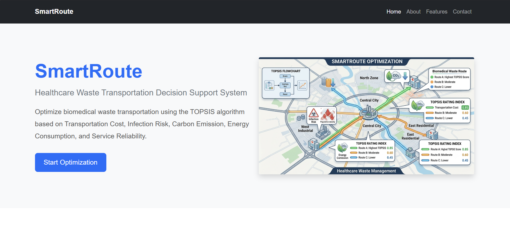
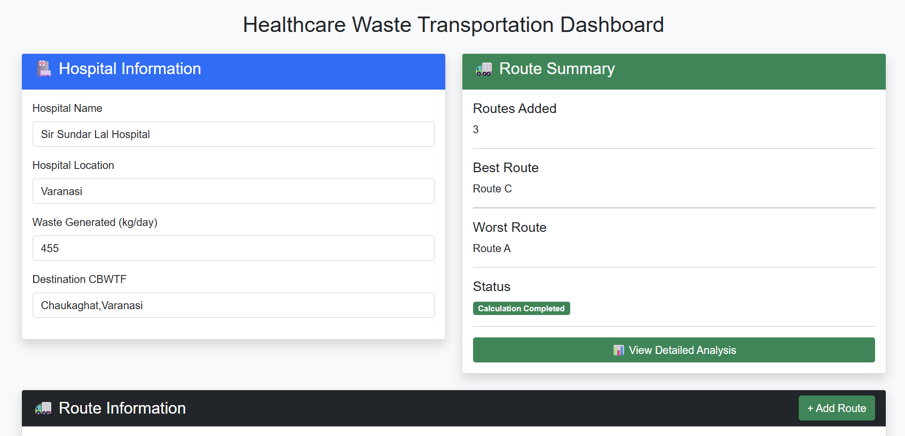
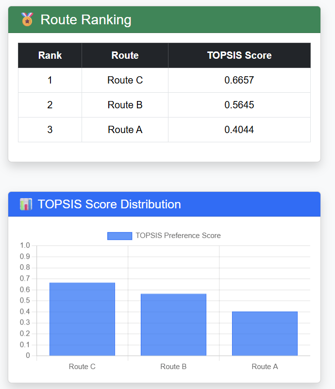
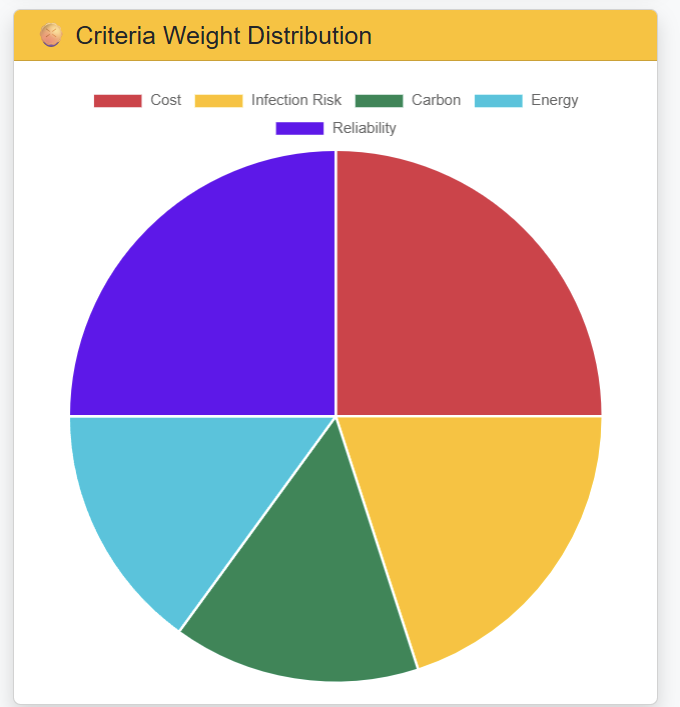
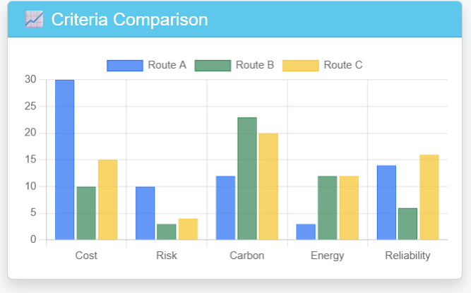
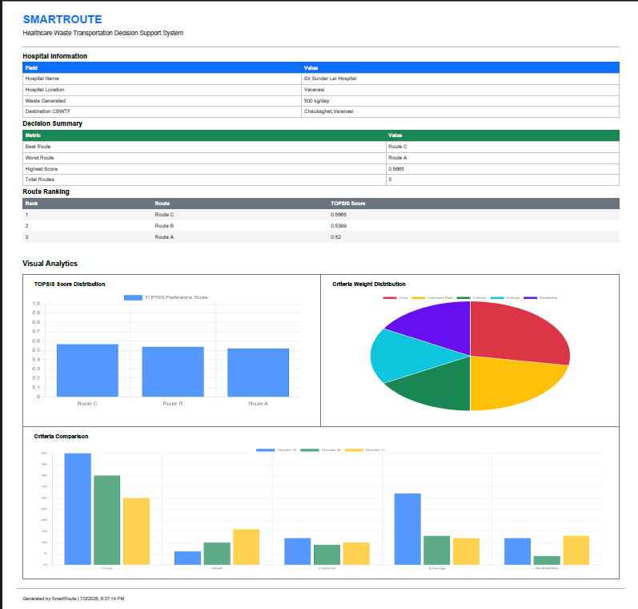

# 🚛 SmartRoute – Healthcare Waste Transportation Route Optimization

A Flask-based web application that optimizes healthcare waste transportation routes using the **TOPSIS (Technique for Order Preference by Similarity to Ideal Solution)** multi-criteria decision-making algorithm.

---

## 🌐 Live Demo

**Render Deployment:** *https://topsis-smartroute.onrender.com/*

**GitHub Repository:** *https://github.com/Coder-G-2007/TOPSIS-SmartRoute*

---
# 📖 Project Overview

Healthcare facilities generate large amounts of biomedical waste every day. Selecting the most suitable transportation route is challenging because multiple conflicting criteria must be considered.

SmartRoute evaluates available transportation routes using the TOPSIS algorithm and recommends the optimal route by considering:

- 💰 Transportation Cost
- ☣️ Infection Risk
- 🌍 Carbon Emission
- ⚡ Energy Consumption
- 🏥 Service Reliability

The application also provides interactive charts and downloadable reports for better decision-making.

---

# ✨ Features

- 🚛 Optimizes healthcare waste transportation routes
- 🧮 Implements the TOPSIS multi-criteria decision-making algorithm
- 📊 Interactive dashboard with charts
- 📄 Generates downloadable PDF reports
- 🌐 Deployed on Render
- 📱 Responsive Bootstrap interface


---

# 🛠️ Technology Stack

| Category | Technology |
|----------|------------|
| Backend | Flask |
| Language | Python |
| Frontend | HTML5, CSS3, Bootstrap |
| Charts | Chart.js |
| PDF | jsPDF |
| Data Processing | NumPy, Pandas |
| Deployment | Render |
| Version Control | Git & GitHub |

---
# 📷 Application Screenshots

## 🏠 Home Page

<p align="center">

</p>

---

## 📝 Route Input

<p align="center">

</p>

---

## 📊 TOPSIS Results

<p align="center">

</p>

---

## 📈 Analytics Dashboard

<p align="center">


</p>

---

## 📄 Generated PDF Report

<p align="center">

</p>

---

# ⚙️ How TOPSIS Works

1. Input route information
2. Assign criteria weights
3. Normalize decision matrix
4. Calculate weighted normalized matrix
5. Determine ideal and negative-ideal solutions
6. Compute separation measures
7. Calculate TOPSIS score
8. Rank all routes
9. Recommend the best route

---

# 📊 Evaluation Criteria

| Criterion | Objective |
|------------|-----------|
| Transportation Cost | Minimize |
| Infection Risk | Minimize |
| Carbon Emission | Minimize |
| Energy Consumption | Minimize |
| Service Reliability | Maximize |

---

# 📂 Project Structure

```text
SmartRoute
│
├── app.py
├── topsis.py
├── requirements.txt
├── routes.csv
├── README.md
│
├── templates/
│
├── static/
│
|__ screenshots/
```

---

# 📈 Future Improvements

- AI-assisted route prediction
- GIS-based live route visualization
- Real-time traffic integration
- Machine Learning route recommendation
- IoT-enabled waste bin monitoring
- Mobile application

---

# 👨‍💻 Author

**Swatantra Singh**

B.Tech Computer Science & Engineering

Jaypee University of Engineering and Technology, Guna

Summer Research Internship (2026)

---

# ⭐ If you found this project useful

Please consider giving this repository a ⭐ on GitHub.
